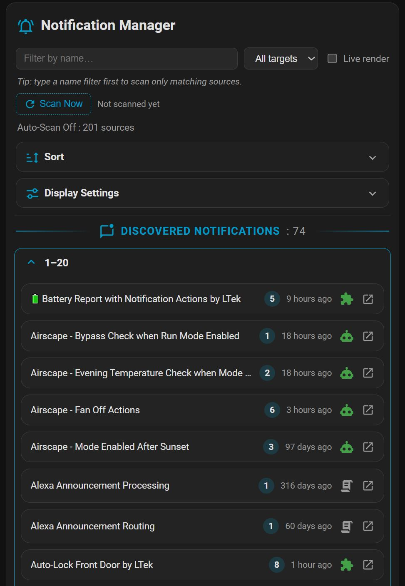
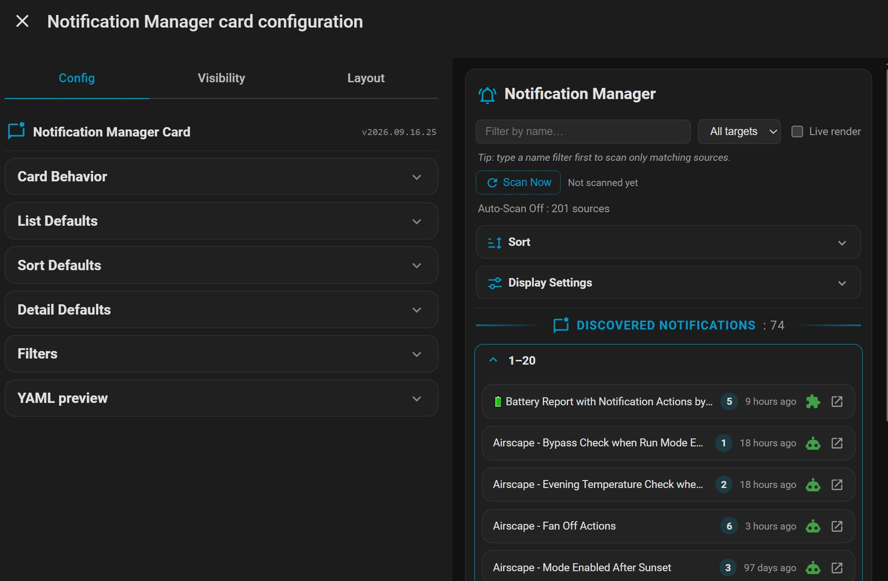

# Notification Manager Card

A Home Assistant Dashboard card that finds **every notification your automations and scripts send** and puts them all in one place — grouped by source, searchable, sortable, and fully editable. Stop opening automations one at a time to fix a typo, retarget a device, or reword an alert.

* **Discovers every `notify.*` action** across your automations and scripts — even ones buried inside `choose`, `if / then / else`, `repeat`, and `parallel` blocks
* **Edit any part inline** — target, title, message, and platform options — with a confirmation prompt, a before→after diff, template validation, and one-click **Undo**
* **Do more than edit** — test-fire, enable/disable, duplicate, delete, bulk-retarget
* **Everything in the card** — no YAML required; templates shown raw or rendered live

https://github.com/Ltek/notification-manager-card

Current build: **v2026.09.16.25**

---

## FEATURES

- **Scans automations, scripts & blueprints** — script `sequence` notify calls are found and fully editable; blueprint automations show who they notify, read from their configured **inputs** (read-only, since HA doesn't expose a blueprint's actions).
- **Actions & bulk operations** — test-fire, inline enable/disable, duplicate, delete, reverse-lookup, plus bulk test-fire / enable-disable / retarget across a selection.
- **Sort, paginate & browse** — sort by name, last-triggered, count, state, or type; break long lists into pages (optionally as collapsible sections) that fill in progressively; a per-source type icon doubles as the on/off toggle.
- **Save safety** — **Undo last save**, a **before→after diff** in the confirmation, and **pre-save template validation**.
- **Scan controls** — optional **Auto-Scan off** mode with a **Scan Now** button (filter by name first to scan only matching sources), a live scan-status line, and an optional "last scan" time.
- **Appearance** — a styled divider with a user-defined icon + label and running discovered-count (e.g. `📛 DISCOVERED NOTIFICATIONS : 87`), an optional header icon, and adjustable name label size/weight.

---

## How it works

Home Assistant doesn't expose an automation's or script's actions as entity state — only its on/off state and a few attributes. This card reads each source's **full configuration** through Home Assistant's own REST config API (the same mechanism the built-in editors use), walks the action tree to find every notify call, and shows them to you. When you save an edit, it writes only the notification you changed back into the source and reloads it — every other action and branch is preserved exactly.

- **Storage (UI) automations & scripts are editable.** Anything you created in the UI can be edited and saved from the card.
- **YAML / package sources are read-only.** Sources defined in YAML files or packages can't be written through the API, so they're shown locked (with a 🔒) rather than editable. *(Whether they appear at all depends on your setup — the card can only read what the API exposes.)*
- **Blueprint automations are read-only, from their inputs.** Home Assistant doesn't expose a blueprint's action tree to a card, so the recipients/title/message shown come from the **inputs you configured** on the blueprint automation. Open the automation to change them.
- **Nothing is stored in the card.** The card's own configuration is just your view preferences (columns, filters, sort, layout, defaults). Your notifications always live in your automations and scripts — the single source of truth.

---

## Options at a glance

Every option below is fully point-and-click — no YAML required.

### Grouping & browsing
- **Grouped by source** — each automation or script is a collapsible group, with its notifications listed as rows beneath it. A source with several notify calls shows them all together.
- **Sort the list** — by name, last-triggered, notification count, on/off state, or source type; ascending or descending. Set a default in the editor or change it live from the card's **Sort** panel.
- **Pagination** — optionally break long lists into pages, and render each page as its own collapsible section.
- **Live status + type icon** — each group's right-side icon shows the source type (automation / blueprint / script) and, for automations, its enabled/disabled state (green/grey); last-triggered time updates live.
- **Show / hide any column** — Target, Title, Message, plus optional Last triggered and Enabled columns, from **Display Settings** on the card.

### Filtering & display
- **Filter by name** and **by notify target** — e.g. show only sources that message `parent_phones`, while still showing *all* the notifications nested in each matching source.
- **Display Settings** panel — show/hide by source type (native automations, blueprint automations, scripts), by editability, by on/off state, and by whether a notification has a title. Filters are a view over your data; they never change anything.

### Editing
- **Per-row Edit button** unlocks that notification's fields; nothing is editable until you choose to edit.
- **Edit every part** — the target `notify.*` service, the title, the message, and the nested platform options (`data`) that iOS/Android and other integrations use.
- **Dirty indicator + Save** — an edited-but-unsaved notification is clearly marked, and a **Save** button appears only when there's something to save.
- **Confirmation with a diff** — before every write, a popup shows a **before→after** of exactly the fields you changed and warns that saving reloads the source (which may re-trigger a live automation).
- **Template validation** — any `{{ }}` in a title/message you edited is checked before saving; a render error is flagged so you can fix it (or choose to save anyway).
- **Undo last save** — the success toast offers a one-click **Undo** that restores the previous version.
- **Surgical, non-destructive saves** — only the notification you edited is changed; the rest of the source — conditions, other actions, and nested branches — is left byte-for-byte intact. Multiple edits within one source are saved together in a single write.

### Actions
- **Test-fire a notification** — send any notification for real, right now, to check it lands and looks right. Templates are rendered to their current values first, and you confirm before anything is sent.
- **Duplicate a notification** — from the edit view, drop a copy of a notification right after the original in the same automation, ready to retarget or reword. Handy for "same alert, second device."
- **Delete a notification** — remove a single notify action from an automation (with confirmation); every other action and branch is left byte-for-byte intact.
- **Enable / disable an automation inline** — the status dot on each group doubles as a toggle; no need to open the automation. It's reversible, so it happens immediately.
- **Reverse lookup** — click a notification's target to instantly filter the card to *everything else* using that same `notify.*` service.

### Bulk operations
- **Select notifications** with the row checkboxes; a selection bar appears with everything you can do to the set at once.
- **Bulk test-fire** — send a test for every selected notification in one go (with a single confirmation summarizing how many, and to how many targets).
- **Bulk enable / disable** — flip all the parent automations of your selection on or off together (shown only when the selection includes at least one automation; scripts are ignored).
- **Bulk retarget** — point every selected notification at a new `notify.*` target at once, coalesced into one write per affected automation.

### Templates
- **Raw by default** — messages and titles are shown exactly as written, Jinja templates and all.
- **Live-render toggle** — flip it on to see what each templated title/message *actually says right now*, updated live as the underlying entities change. Template errors show inline without breaking the card.

### Scanning
- **Fast scanning** — configs are fetched in parallel; the list fills in progressively and a status line shows "Auto-Scan On : N sources" or scan progress.
- **Auto-Scan off (optional)** — defer scanning until you press **Scan Now**, so the card makes no config-API calls on load. Type a **name filter first** to scan only matching sources.
- **Appearance** — a styled divider (icon + label + discovered count) and an optional header icon; name label size/weight; and which panels (Display, Sort) appear on the card — all configurable in the editor.

---

## Installation

### Via HACS (recommended)

[](https://my.home-assistant.io/redirect/hacs_repository/?owner=Ltek&repository=notification-manager-card&category=dashboard)

1. Click the badge above (adds this repo to HACS), or in HACS → **⋮ → Custom repositories** add `https://github.com/Ltek/notification-manager-card` as type **Dashboard**.
2. Install **Notification Manager Card**. HACS adds the Dashboard resource for you.
3. Clear your browser cache and hard-refresh.

### Manual

1. Create the folder `\config\www\community\notification-manager-card`.
2. Download the card's `.js` file from [the repository](https://github.com/Ltek/notification-manager-card) and place it in that folder.
3. Add it as a Dashboard resource:
   - **Settings → Dashboards → ⋮ → Resources → Add Resource**
   - URL: `/local/community/notification-manager-card/notification-manager-card.js`  ·  Type: **JavaScript Module**
4. Clear your browser cache and hard-refresh.

Then add the card from the card picker (**Notification Manager Card**), or in YAML:

```yaml
type: custom:notification-manager-card
```

> **Note:** the Dashboard card type is `custom:notification-manager-card`. Editing notifications requires an **admin** account (the same permission Home Assistant requires to edit automations).

---

## Screenshots

<!-- SCREENSHOTS:START -->
<table>
  <tr>
    <td align="center" valign="top">
      
    </td>
    <td align="center" valign="top">
      
    </td>
    <td></td>
    <td></td>
  </tr>
</table>
<!-- SCREENSHOTS:END -->
